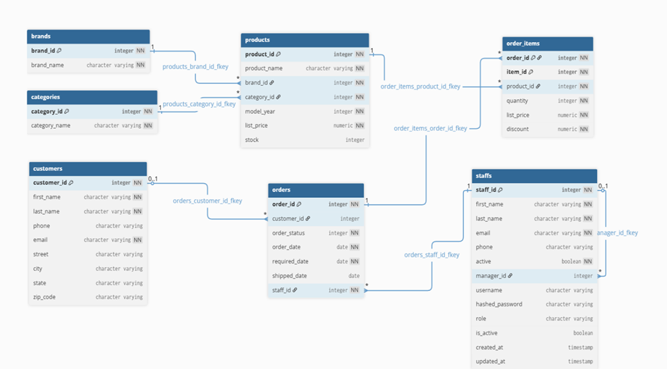
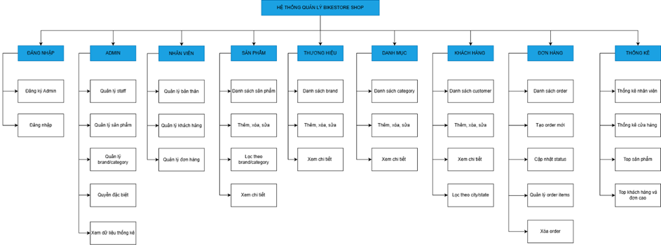
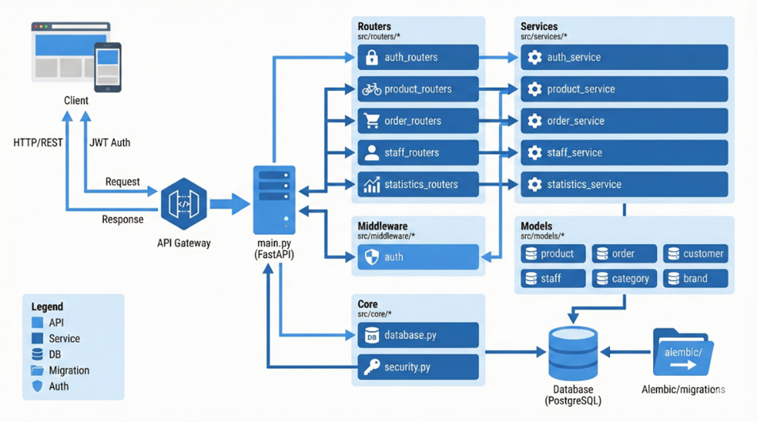

# HỆ THỐNG BACKEND API SERVER CHO CỬA HÀNG BÁN XE ĐẠP

## Thông tin

**Nhóm thực hiện:** Nhóm 08

**Sinh viên thực hiện:**

| STT | Họ tên | MSSV | Ngành |
|-----|--------|------|-------|
| 1 | Nguyễn Hà Minh Tuấn | 23521718 | CNTT |
| 2 | Trần Phan Thanh Tùng | 23521747 | CNTT |

## Giới thiệu

Đề tài xây dựng hệ thống Backend API Server cho cửa hàng bán xe đạp nhằm triển khai một **RESTful API server** để quản lý hoạt động kinh doanh cho cửa hàng xe đạp một cách hiệu quả và có hệ thống, từ việc quản lý, phân quyền cho nhân viên đến việc quản lý sản phẩm, đặt hàng và thống kê hoạt động kinh doanh của cửa hàng.

### Đặc điểm nổi bật

- **Framework:** FastAPI với kiến trúc MVC
- **API Documentation:** Tự động tài liệu hóa thông qua Swagger UI
- **Bảo mật:** JWT (JSON Web Tokens) cho xác thực và phân quyền
- **Database:** PostgreSQL với SQLAlchemy ORM
- **Migration:** Quản lý phiên bản cơ sở dữ liệu với Alembic
- **Testing:** Tích hợp Pytest cho kiểm thử tự động

Hệ thống hoàn chỉnh với **54 endpoints**, vận hành ổn định và sẵn sàng tích hợp với các ứng dụng Frontend.

> **Lưu ý:** Thiết kế cơ sở dữ liệu được tham khảo từ BikeStores Sample Database, sau đó được chuẩn hóa và thiết kế lại phù hợp với yêu cầu hệ thống.

## Cơ sở dữ liệu

### Sơ đồ cơ sở dữ liệu



### Mô tả các bảng

Cơ sở dữ liệu bao gồm **7 bảng chính** lưu trữ thông tin nhân viên và hoạt động kinh doanh:

#### 1. Bảng `brands` - Thương hiệu xe đạp

| Tên cột | Kiểu dữ liệu | Ý nghĩa |
|---------|--------------|---------|
| `brand_id` | integer | Mã thương hiệu (khóa chính) |
| `brand_name` | varchar | Tên thương hiệu |

#### 2. Bảng `categories` - Danh mục sản phẩm

| Tên cột | Kiểu dữ liệu | Ý nghĩa |
|---------|--------------|---------|
| `category_id` | integer | Mã danh mục (khóa chính) |
| `category_name` | varchar | Tên danh mục |

#### 3. Bảng `customers` - Khách hàng

| Tên cột | Kiểu dữ liệu | Ý nghĩa |
|---------|--------------|---------|
| `customer_id` | integer | Mã khách hàng (khóa chính) |
| `first_name` | varchar | Tên khách hàng |
| `last_name` | varchar | Họ khách hàng |
| `phone` | varchar | Số điện thoại |
| `email` | varchar | Email khách hàng |
| `street` | varchar | Địa chỉ đường |
| `city` | varchar | Thành phố |
| `state` | varchar | Tỉnh/Bang |
| `zip_code` | varchar | Mã bưu điện |

#### 4. Bảng `products` - Sản phẩm

| Tên cột | Kiểu dữ liệu | Ý nghĩa |
|---------|--------------|---------|
| `product_id` | integer | Mã sản phẩm (khóa chính) |
| `product_name` | varchar | Tên sản phẩm |
| `brand_id` | integer | Mã thương hiệu (khóa ngoại) |
| `category_id` | integer | Mã danh mục (khóa ngoại) |
| `model_year` | integer | Năm sản xuất |
| `list_price` | numeric | Giá niêm yết |
| `stock` | integer | Số lượng tồn kho |

#### 5. Bảng `orders` - Đơn hàng

| Tên cột | Kiểu dữ liệu | Ý nghĩa |
|---------|--------------|---------|
| `order_id` | integer | Mã đơn hàng (khóa chính) |
| `customer_id` | integer | Mã khách hàng (khóa ngoại) |
| `order_status` | integer | Trạng thái đơn hàng |
| `order_date` | date | Ngày đặt hàng |
| `required_date` | date | Ngày yêu cầu giao |
| `shipped_date` | date | Ngày giao hàng |
| `staff_id` | integer | Mã nhân viên xử lý |

#### 6. Bảng `order_items` - Chi tiết đơn hàng

| Tên cột | Kiểu dữ liệu | Ý nghĩa |
|---------|--------------|---------|
| `order_id` | integer | Mã đơn hàng (khóa ngoại) |
| `item_id` | integer | Số thứ tự sản phẩm |
| `product_id` | integer | Mã sản phẩm (khóa ngoại) |
| `quantity` | integer | Số lượng mua |
| `list_price` | numeric | Giá tại thời điểm bán |
| `discount` | numeric | Mức giảm giá |

#### 7. Bảng `staffs` - Nhân viên

| Tên cột | Kiểu dữ liệu | Ý nghĩa |
|---------|--------------|---------|
| `staff_id` | integer | Mã nhân viên (khóa chính) |
| `first_name` | varchar | Tên nhân viên |
| `last_name` | varchar | Họ nhân viên |
| `email` | varchar | Email (duy nhất) |
| `phone` | varchar | Số điện thoại |
| `active` | boolean | Trạng thái làm việc |
| `manager_id` | integer | Mã quản lý trực tiếp |
| `username` | varchar | Tên đăng nhập |
| `hashed_password` | varchar | Mật khẩu đã mã hóa |
| `role` | varchar | Vai trò nhân viên |
| `is_active` | boolean | Trạng thái tài khoản |
| `created_at` | timestamp | Thời điểm tạo |
| `updated_at` | timestamp | Thời điểm cập nhật |

## ⚙️ Chức năng hệ thống



### Xác thực và Bảo mật (5 endpoints)

- Đăng ký tài khoản Admin mới
- Đăng nhập cho toàn bộ người dùng
- Xác thực JWT Token
- Quản lý phiên đăng nhập
- Phân quyền truy cập

### Quản lý Nhân viên - Admin (5 endpoints)

**Admin** có toàn quyền quản lý hệ thống:

- Thêm, xóa, sửa thông tin nhân viên dưới quyền
- Quản lý sản phẩm
- Quản lý thương hiệu và danh mục
- Xem dữ liệu thống kê kinh doanh
- Phân quyền cho nhân viên

### Chức năng Nhân viên (Staff)

Nhân viên dưới quyền quản lý của Admin:

- Quản lý tài khoản cá nhân (trừ email được cấp)
- Tạo mới đơn hàng
- Quản lý thông tin khách hàng

### Quản lý Sản phẩm (5 endpoints)

- Xem danh sách sản phẩm với phân trang
- Xem chi tiết một sản phẩm
- Thêm sản phẩm mới
- Cập nhật thông tin sản phẩm
- Xóa sản phẩm
- **Bộ lọc tìm kiếm:** theo tên, thương hiệu, danh mục, giá, năm sản xuất

### Quản lý Thương hiệu (5 endpoints)

- Xem danh sách thương hiệu
- Xem chi tiết thương hiệu
- Thêm thương hiệu mới
- Cập nhật thông tin thương hiệu
- Xóa thương hiệu

### Quản lý Danh mục (5 endpoints)

- Xem danh sách danh mục sản phẩm
- Xem chi tiết danh mục
- Thêm danh mục mới
- Cập nhật thông tin danh mục
- Xóa danh mục

### Quản lý Khách hàng (5 endpoints)

- Xem danh sách khách hàng với phân trang
- Xem chi tiết thông tin khách hàng
- Tạo mới khách hàng
- Cập nhật thông tin khách hàng
- **Bộ lọc tìm kiếm:** theo tên, email, số điện thoại, địa chỉ

### Quản lý Đơn hàng (9 endpoints)

- Xem danh sách đơn hàng
- Xem chi tiết đơn hàng (bao gồm order_items)
- Tạo đơn hàng mới
- Cập nhật trạng thái đơn hàng
- Hủy/Xóa đơn hàng theo yêu cầu
- Theo dõi tiến độ giao hàng
- Lọc đơn hàng theo trạng thái
- Tìm kiếm đơn hàng theo khách hàng
- Xuất báo cáo đơn hàng

### Thống kê Kinh doanh (13 endpoints)

#### Thống kê Nhân viên

- Số lượng nhân viên hiện tại
- Tổng doanh số của nhân viên (số đơn hàng, số xe bán, tổng doanh thu)
- Doanh số theo từng nhân viên
- Doanh số nhân viên theo ngày
- Doanh số nhân viên theo tháng

#### Thống kê Cửa hàng

- **Tổng quan:** Tổng doanh thu, tổng đơn hàng, tổng xe bán, tổng khách hàng
- Doanh số theo ngày
- Doanh số theo tháng
- Doanh số theo quý
- Doanh số theo năm

#### Thống kê Sản phẩm và Khách hàng

- Top sản phẩm bán chạy nhất
- Đơn hàng có giá trị cao nhất
- Khách hàng mua nhiều nhất theo giá trị đơn hàng

### Kiểm tra Hệ thống (2 endpoints)

- Health check endpoint
- System status endpoint

## Kiến trúc hệ thống



## Cài đặt và Triển khai

### Yêu cầu hệ thống

- **Python:** 3.9 hoặc mới hơn
- **PostgreSQL:** 12+ (hoặc database tương thích)

### Cài đặt trên Windows (PowerShell)

#### Bước 1: Clone và di chuyển vào thư mục dự án

```powershell
git clone <repository-url>
cd BikestoreShop
```

#### Bước 2: Tạo và kích hoạt Virtual Environment

```powershell
python -m venv .venv
.\.venv\Scripts\Activate.ps1
```

#### Bước 3: Cài đặt Dependencies

```powershell
pip install -r src/requirements.txt
```

### Thiết lập Database

#### Bước 1: Tạo Database PostgreSQL

```powershell
psql -U postgres
CREATE DATABASE bikestore_db;
\q
```

#### Bước 2: Chạy Migration Script

```powershell
# Tạo cấu trúc database
psql -U postgres -d bikestore_db -f database/create_database.sql

# Load dữ liệu mẫu
psql -U postgres -d bikestore_db -f database/loading_data_to_database.sql
```

#### Bước 3: Cấu hình Database Connection

Tạo file `.env` trong thư mục `src/`:

```env
# manage datasbase
DATABASE_USERNAME=
DATABASE_PASSWORD=
DATABASE_HOST=
DATABASE_PORT=
DATABASE_DB=bikestore_db
DATABASE_URL=postgresql://${DATABASE_USERNAME}:${DATABASE_PASSWORD}@${DATABASE_HOST}:${DATABASE_PORT}/${DATABASE_DB}


# JWT Security
SECRET_KEY=your-secret-key-at-least-32-characters-long-change-this-in-production
ALGORITHM=HS256
ACCESS_TOKEN_EXPIRE_MINUTES=

```

#### Bước 4: Chạy Alembic Migration

```powershell
cd src
alembic upgrade head
```

### Chạy ứng dụng

```powershell
# Đảm bảo virtual environment đã được kích hoạt
uvicorn src.main:app --reload --host 0.0.0.0 --port 8000
```

Ứng dụng sẽ chạy tại:
- **API Server:** http://127.0.0.1:8000
- **Swagger UI:** http://127.0.0.1:8000/docs
- **ReDoc:** http://127.0.0.1:8000/redoc

## Cấu trúc dự án

```
BikestoreShop/
│
├── README.md                          # Tài liệu dự án
├── openai.json                        # Cấu hình OpenAI
│
├── database/                          # Database scripts
│   ├── create_database.sql           # Script tạo schema
│   ├── database_decription.md        # Mô tả database
│   └── loading_data_to_database.sql  # Script load dữ liệu mẫu
│
├── image/                             # Hình ảnh tài liệu
│   ├── database_schema.png
│   ├── system_features.png
│   └── mvc_architecture.png
│
├── src/                               # Mã nguồn chính
│   ├── main.py                       # Entry point
│   ├── requirements.txt              # Python dependencies
│   ├── alembic.ini                   # Cấu hình Alembic
│   ├── nixpacks.toml                 # Deploy config
│   ├── Procfile                      # Process config
│   ├── railway.json                  # Railway deploy
│   │
│   ├── alembic/                      # Database migrations
│   │   ├── env.py
│   │   ├── script.py.mako
│   │   └── versions/
│   │
│   ├── core/                         # Core components
│   │   ├── __init__.py
│   │   ├── database.py              # DB connection
│   │   └── security.py              # Security utilities
│   │
│   ├── middleware/                   # Middleware components
│   │   ├── __init__.py
│   │   └── auth.py                  # Auth middleware
│   │
│   ├── models/                       # SQLAlchemy models
│   │   ├── __init__.py
│   │   ├── brand.py
│   │   ├── category.py
│   │   ├── customer.py
│   │   ├── order.py
│   │   ├── order_item.py
│   │   ├── product.py
│   │   └── staff.py
│   │
│   ├── routers/                      # API routers
│   │   ├── __init__.py
│   │   ├── auth_routers.py
│   │   ├── brand_routers.py
│   │   ├── category_routers.py
│   │   ├── customer_routers.py
│   │   ├── order_routers.py
│   │   ├── product_routers.py
│   │   ├── staff_routers.py
│   │   └── statistics_routers.py
│   │
│   ├── schemas/                      # Pydantic schemas
│   │   ├── __init__.py
│   │   ├── auth.py
│   │   ├── brand.py
│   │   ├── category.py
│   │   ├── customer.py
│   │   ├── order.py
│   │   ├── product.py
│   │   ├── staff.py
│   │   └── statistics.py
│   │
│   └── services/                     # Business logic
│       ├── __init__.py
│       ├── auth_service.py
│       ├── brand_service.py
│       ├── category_service.py
│       ├── customer_service.py
│       ├── order_service.py
│       ├── product_service.py
│       ├── staff_service.py
│       └── statistics_service.py
│
└── tests/                             # Test suite
    ├── conftest.py
    ├── test_all_endpoints.py
    └── test_auth.py
```

## Kiểm thử

### Chạy Test Suite

```powershell
# Cài đặt pytest nếu chưa có
pip install pytest pytest-asyncio httpx

# Chạy toàn bộ test
pytest tests/

# Chạy test với coverage
pytest tests/ --cov=src --cov-report=html

# Chạy test cụ thể
pytest tests/test_auth.py
pytest tests/test_all_endpoints.py
```

### Kiểm thử thủ công với Swagger UI

1. Truy cập http://127.0.0.1:8000/docs
2. Sử dụng endpoint `/auth/register` để tạo tài khoản Admin
3. Đăng nhập qua `/auth/login` để lấy JWT token
4. Click "Authorize" và nhập token
5. Thử nghiệm các endpoint khác

## Đóng góp

Mọi đóng góp đều được chào đón! Vui lòng:

1. Fork repository
2. Tạo feature branch (`git checkout -b feature/AmazingFeature`)
3. Commit changes (`git commit -m 'Add some AmazingFeature'`)
4. Push to branch (`git push origin feature/AmazingFeature`)
5. Mở Pull Request

## Liên hệ

- **Nguyễn Hà Minh Tuấn** - MSSV: 23521718
- **Trần Phan Thanh Tùng** - MSSV: 23521747

## License

Dự án này được phát triển cho mục đích học tập và nghiên cứu.

---

**Developed with ❤️ by Nhóm 08 - UIT - Kĩ thuật lập trình Python**
